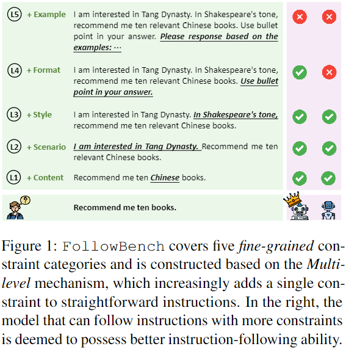
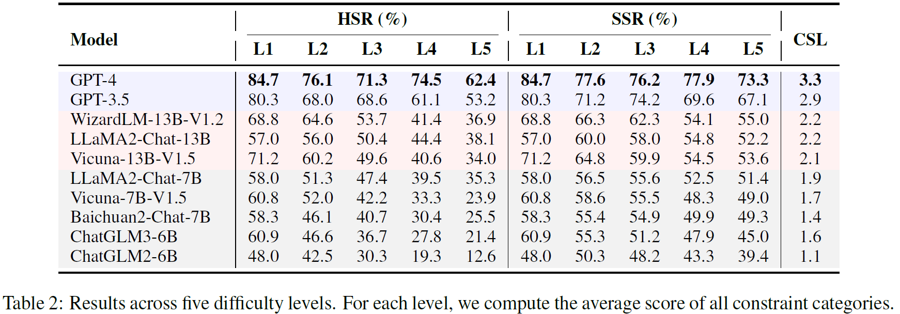

# FollowBench: A Multi-level Fine-grained Constraints Following Benchmark for Large Language Models

arXiv preprint: https://arxiv.org/abs/2310.20410

we introduce **FollowBench**, a Multi-level Fine-grained Constraints Following Benchmark for LLMs.
- **FollowBench** comprehensively includes five different types (i.e., Content, Situation, Style, Format, and Example) of _fine-grained constraints_. 
- To enable a precise constraint following estimation on diverse difficulties, we introduce a _Multi-level_ mechanism that incrementally adds a single constraint to the initial instruction at each increased level. 
- To evaluate whether LLMs' outputs have satisfied every individual constraint, we propose to prompt strong LLMs with _constraint-evolution paths_ to handle challenging open-ended instructions. 

<p align="center">
    <br>
    
    <br>
</p>


## Data
The data of FollowBench can be found in the [data/](data/).


## How to Implement

### 1. Install Dependencies

```
conda create -n followbench python=3.10
conda activate followbench
conda install pytorch==1.13.1 torchvision==0.14.1 torchaudio==0.13.1 pytorch-cuda=11.7 -c pytorch -c nvidia
pip install -r requirements.txt
```

### 2. Model Inference
```bash
cd FollowBench/
python code/model_inference.py --model-path <model_name_or_path>
```

### 3. LLM-based Evaluation
```bash
cd FollowBench/
python code/llm_eval.py --model-path <model_name_or_path> --api_key <your_own_gpt4_api_key>
```

### 4. Merge Evaluation and Save Results 
Next, we can merge the rule-based evaluation results and LLM-based evaluation results using the following script:
```bash
cd FollowBench/
python code/eval.py --model_names <a_list_of_evaluated_models>
```
The final results will be saved in the folder named ```evaluation_result```.

## Experiments
By evaluating **10** closed-source and open-source popular LLMs on FollowBench, we highlight the weaknesses of LLMs in instruction following and point towards potential avenues for future work.

<p align="center">
    <br>
    
    <br>
</p>

<p align="center">
    <br>
    
    <br>
</p>


## Citation
Please cite our paper if you use the code in this repo.
```
@misc{jiang2023followbench,
      title={FollowBench: A Multi-level Fine-grained Constraints Following Benchmark for Large Language Models}, 
      author={Yuxin Jiang and Yufei Wang and Xingshan Zeng and Wanjun Zhong and Liangyou Li and Fei Mi and Lifeng Shang and Xin Jiang and Qun Liu and Wei Wang},
      year={2023},
      eprint={2310.20410},
      archivePrefix={arXiv},
      primaryClass={cs.CL}
}
```
