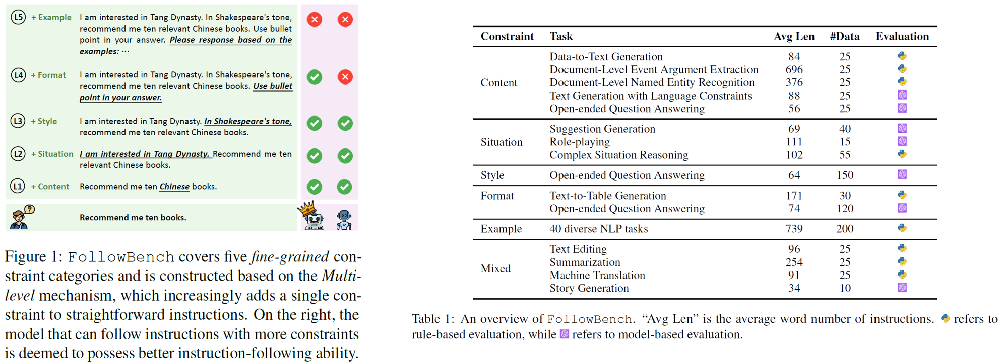
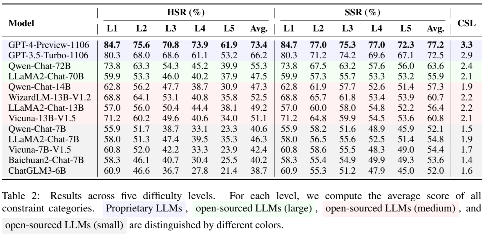
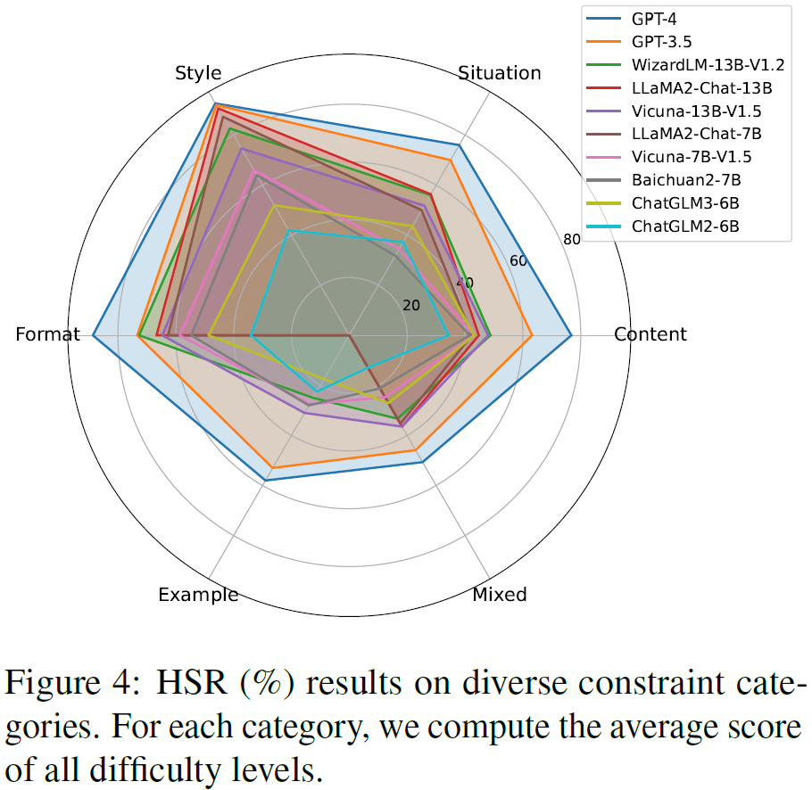

# FollowBench: A Multi-level Fine-grained Constraints Following Benchmark for Large Language Models

We introduce **FollowBench**, a Multi-level Fine-grained Constraints Following Benchmark for **systemically** and **precisely** evaluate the instruction-following capability of LLMs.
- **FollowBench** comprehensively includes five different types (i.e., Content, Situation, Style, Format, and Example) of _fine-grained constraints_. 
- To enable a precise constraint following estimation on diverse difficulties, we introduce a _Multi-level_ mechanism that incrementally adds a single constraint to the initial instruction at each increased level. 
- To evaluate whether LLMs' outputs have satisfied every individual constraint, we propose to prompt strong LLMs with _constraint-evolution paths_ to handle challenging open-ended instructions.
- By evaluating **14** closed-source and open-source popular LLMs on FollowBench, we highlight the weaknesses of LLMs in instruction following and point towards potential avenues for future work.

<p align="center">
    <br>
    
    <br>
</p>

## 🔥 Updates
* 2023/12/20: We evaluated Qwen-Chat-72B/14B/7B on FollowBench, check it in [Leaderboard](#leaderboard).
* 2023/12/15: We released a Chinese version of FolllowBench, check it in [data_zh/](data_zh/).
* 2023/11/14: We released the second verson of our [paper](https://arxiv.org/abs/2310.20410). Check it out!
* 2022/11/10: We released the data and code of FollowBench.
* 2023/10/31: We released the first verson of our [paper](https://arxiv.org/abs/2310.20410v1). Check it out!


## 🔍 Table of Contents
  - [🖥️ Leaderboard](#leaderboard)
  - [📄 Data of FollowBench](#data-of-followbench)
  - [⚙️ How to Evaluate on FollowBench](#how-to-evaluate-on-followbench)
  - [📝 Citation](#citation)


<a name="leaderboard"></a>
## 🖥️ Leaderboard

### Metrics
* **Hard Satisfaction Rate (HSR):** the average rate at which all constraints of individual instructions are fully satisfied
* **Soft Satisfaction Rate (SSR):** the average satisfaction rate of individual constraints across all instructions
* **Consistent Satisfaction Levels (CSL):** how many consecutive levels a model can satisfy, beginning from level 1


### Level-categorized Results
**English**
<p align="center">
    <br>
    
    <br>
</p>

### Constraint-categorized Results
**English**
<p align="center">
    <br>
    
    <br>
</p>

<a name="data-of-followbench"></a>
## 📄 Data of FollowBench
The data of FollowBench can be found in [data/](data/).

We also provide a **Chinese version** of FollowBench in [data_zh/](data_zh/).


<a name="how-to-evaluate-on-followbench"></a>
## ⚙️ How to Evaluate on FollowBench

#### Install Dependencies

```
conda create -n followbench python=3.10
conda activate followbench
conda install pytorch==1.13.1 torchvision==0.14.1 torchaudio==0.13.1 pytorch-cuda=11.7 -c pytorch -c nvidia
pip install -r requirements.txt
```

#### Model Inference
```bash
cd FollowBench/
python code/model_inference.py --model_path <model_name_or_path>
```

#### LLM-based Evaluation
```bash
cd FollowBench/
python code/llm_eval.py --model_path <model_name_or_path> --api_key <your_own_gpt4_api_key>
```

#### Merge Evaluation and Save Results 
Next, we can merge the **rule-based evaluation** results and **LLM-based evaluation** results using the following script:
```bash
cd FollowBench/
python code/eval.py --model_paths <a_list_of_evaluated_models>
```
The final results will be saved in the folder named ```evaluation_result```.


<a name="citation"></a>
## 📝 Citation
Please cite our paper if you use the data or code in this repo.
```
@misc{jiang2023followbench,
      title={FollowBench: A Multi-level Fine-grained Constraints Following Benchmark for Large Language Models}, 
      author={Yuxin Jiang and Yufei Wang and Xingshan Zeng and Wanjun Zhong and Liangyou Li and Fei Mi and Lifeng Shang and Xin Jiang and Qun Liu and Wei Wang},
      year={2023},
      eprint={2310.20410},
      archivePrefix={arXiv},
      primaryClass={cs.CL}
}
```
